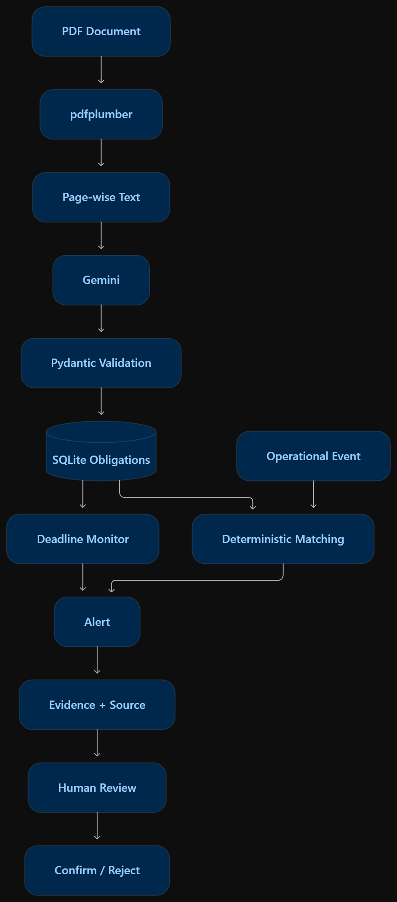
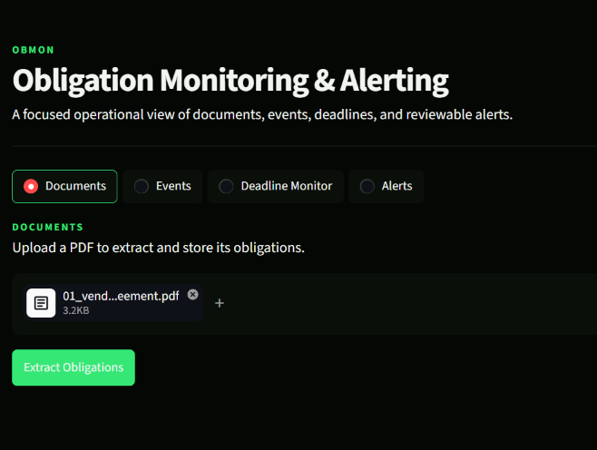
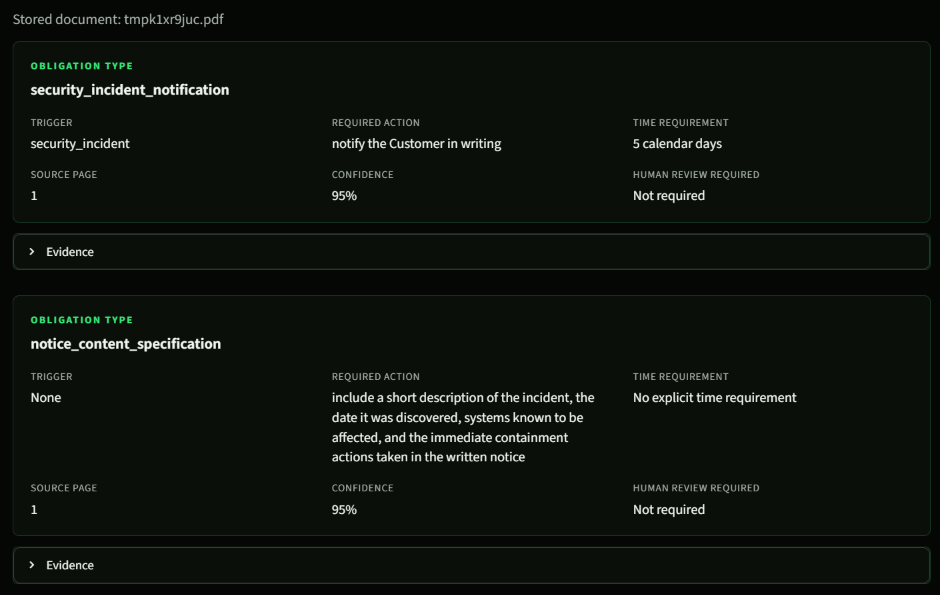
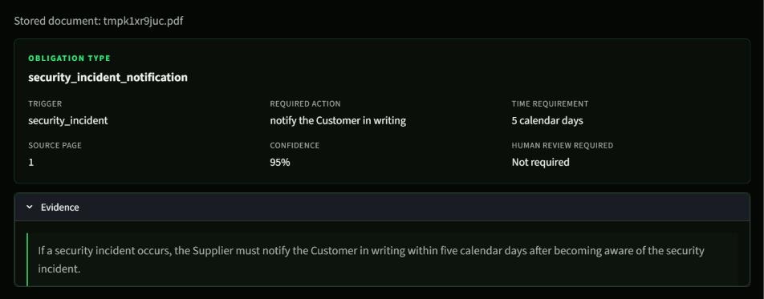
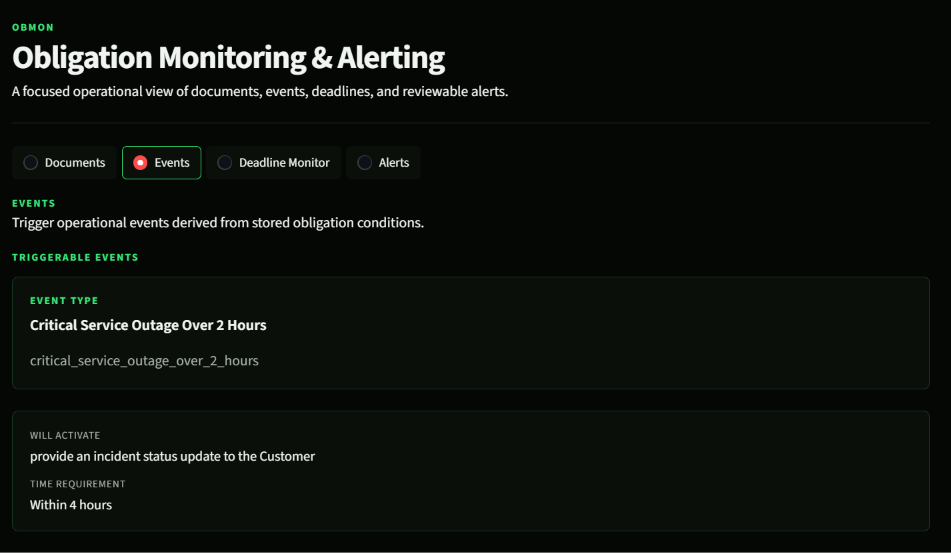
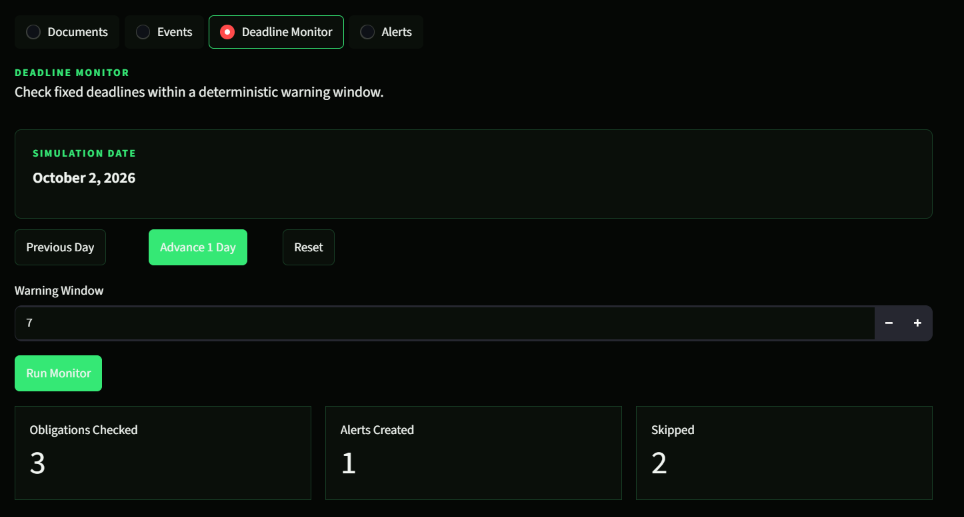
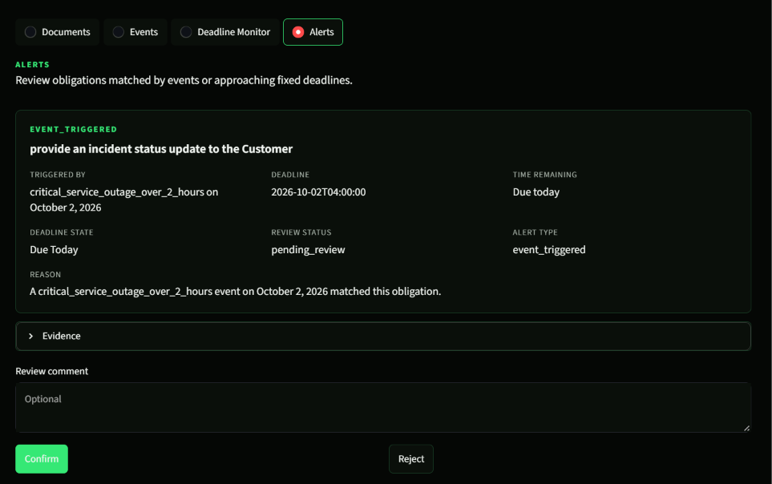
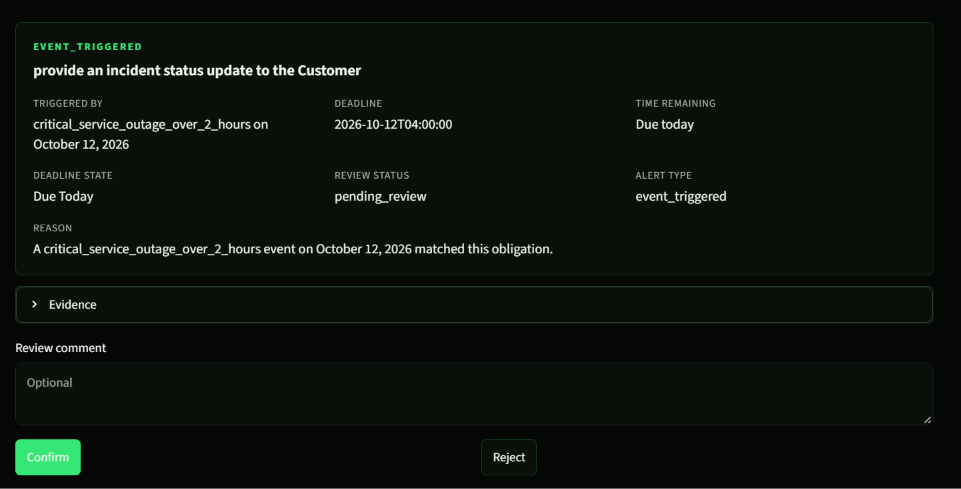
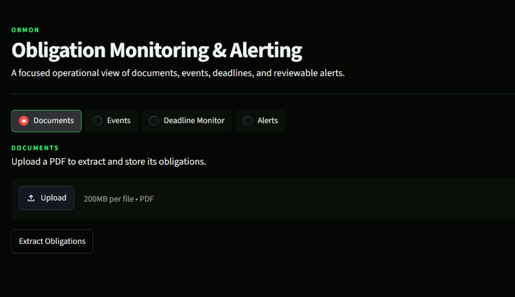

# OBMON

## Obligation Monitoring & Alerting

OBMON turns important rules in a PDF into work that a team can follow.

The basic story is simple:

1. Upload a PDF.
2. OBMON reads the PDF page by page.
3. Gemini finds the actions the document requires and keeps the source quote and page number.
4. The obligations are checked and stored in SQLite.
5. When an operational event happens, OBMON matches it to the right obligation.
6. Deadline alerts are created with their evidence and source.
7. A person reviews each alert and confirms or rejects it.

The app is a small local prototype with a FastAPI backend, a Streamlit web UI,
and a local SQLite database.



## What you can do

- Upload a text-based PDF and extract its obligations.
- See each obligation's trigger, required action, timing, source page, and review flag.
- Create a real operational event or trigger one from the Events page.
- Match events to obligations using exact event types.
- Monitor fixed deadlines inside a warning window.
- Review alerts separately from events, with evidence and source information.
- Move a persisted demo date forward or reset it to test deadline behavior.

## Requirements

- Python 3.13
- [uv](https://docs.astral.sh/uv/)
- A Gemini API key for PDF obligation extraction

The repository pins its Python version in `.python-version` and its dependency
versions in `uv.lock`.

## Set up a fresh checkout

From the project directory:

```powershell
uv sync --locked
Copy-Item .env.example .env
```

Open `.env` and replace the placeholder with your Gemini API key:

```text
GEMINI_API_KEY=your-gemini-api-key
```

`.env` and `obmon.db` are local files and are ignored by Git. Never commit a
real API key.

If you already have a `.env` file, keep it and only run the `uv sync --locked`
command.

## Run OBMON

Start the backend in one terminal:

```powershell
uv run uvicorn app.main:app --reload
```

Check that it is running:

```powershell
Invoke-RestMethod http://127.0.0.1:8000/health
```

You should see:

```text
status
------
ok
```

Start the web UI in a second terminal:

```powershell
$env:OBMON_API_URL = "http://127.0.0.1:8000"
uv run streamlit run ui/app.py
```

Open the URL printed by Streamlit, normally
<http://localhost:8501>.

The backend API is available at <http://127.0.0.1:8000>. FastAPI's interactive
API page is at <http://127.0.0.1:8000/docs>.

## Use the web app

### 1. Documents

Open **Documents**, upload a PDF, and choose **Extract Obligations**.

OBMON expects a PDF with selectable text. It does not run OCR. For each page,
`pdfplumber` extracts the text, Gemini returns structured obligations, and
Pydantic validates the result before it is saved.

The extracted record keeps:

- the required action;
- the event or condition that activates it;
- the time requirement;
- the exact evidence text;
- the source page; and
- whether a person should review the interpretation.





### 2. Events

Open **Events** to see event types that can be triggered from the stored
obligations. You can trigger a suggested event or create one with an external
ID, event type, date, time, description, and source.

Event matching is exact. For example, an obligation with the trigger
`security_incident` matches an event whose type is exactly
`security_incident`.

The Events page shows events and their matched obligation context. Alerts are
kept on the separate **Alerts** page.



### 3. Deadline Monitor

Open **Deadline Monitor**, choose a warning window, and run the monitor. OBMON
checks fixed deadlines and creates reviewable alerts for deadlines that are
inside the window or already overdue.

The demo clock starts at **2026-10-02**. Use **Advance 1 Day** and **Reset** to
test how alert deadline states change over time.



### 4. Alerts

Open **Alerts** to review the alerts created from matching events or approaching
deadlines. Each alert includes its reason, required action, evidence, source
page, and current deadline state.

Use **Confirm** or **Reject** to record the human decision. This review step is
deliberate: the system finds and explains a possible obligation, but a person
makes the final decision.






## How the pieces fit together

```text
PDF
  -> pdfplumber
  -> page-wise text
  -> Gemini structured extraction
  -> Pydantic validation
  -> SQLite obligations
       |                   |
       v                   v
  Deadline monitor    Deterministic event matching
       |                   |
       +---------> Alert <-+
                       |
                 Evidence + source
                       |
                  Human review
                       |
                 Confirm / Reject
```

The application keeps extraction and matching separate:

- Gemini helps interpret the document once.
- Event matching uses stored trigger types and does not ask an AI model to
  decide whether an event matches.
- Deadline states are derived from the persisted simulation date.
- Human decisions are stored separately from the calculated deadline state.

## Local data

By default, OBMON stores data in `obmon.db` in the project directory. The
database contains documents, extracted obligations, events, alerts, reviews,
and the demo simulation date.

To start a new local demo, stop the app and remove `obmon.db`, then start the
backend again. The database will be created on first use.

## API examples

The UI is the easiest way to use OBMON, but the backend can also be called
directly.

Health check:

```powershell
Invoke-RestMethod http://127.0.0.1:8000/health
```

Parse a PDF without saving obligations:

```powershell
Invoke-RestMethod `
  -Method Post `
  -Uri http://127.0.0.1:8000/documents/parse `
  -Form @{ file = Get-Item .\sample.pdf }
```

Extract and save obligations:

```powershell
Invoke-RestMethod `
  -Method Post `
  -Uri http://127.0.0.1:8000/documents/extract-obligations `
  -Form @{ file = Get-Item .\sample.pdf }
```

Useful read endpoints include:

- `GET /documents`
- `GET /obligations`
- `GET /events`
- `GET /alerts`
- `GET /simulation/date`

## Run the tests

Run the test suite with the locked environment:

```powershell
uv run --locked pytest -q
```

The tests cover PDF parsing, obligation extraction, API endpoints, event
matching, deadline monitoring, alert review, and the simulation clock.

## Project layout

```text
app/                  FastAPI API, database models, schemas, and services
ui/app.py             Streamlit web interface
data/                 Local demo or seed data, when present
docs/images/          Architecture and UI reference images
tests/                Automated tests
pyproject.toml        Project metadata and dependencies
uv.lock               Reproducible dependency lock file
```

## Troubleshooting

**The UI says the backend is unavailable**

Make sure the Uvicorn terminal is still running and that
`OBMON_API_URL` points to the same address used by the backend.

**Extraction says `GEMINI_API_KEY` is not configured**

Check that `.env` exists in the project directory and contains a valid key,
then restart Uvicorn.

**The PDF produces no obligations**

Make sure the document contains selectable text and clear required actions.
Scanned image-only PDFs need OCR before OBMON can read them.

**An event does not match**

Compare the event type with the trigger shown on the Events page. Matching is
case-sensitive and exact.
